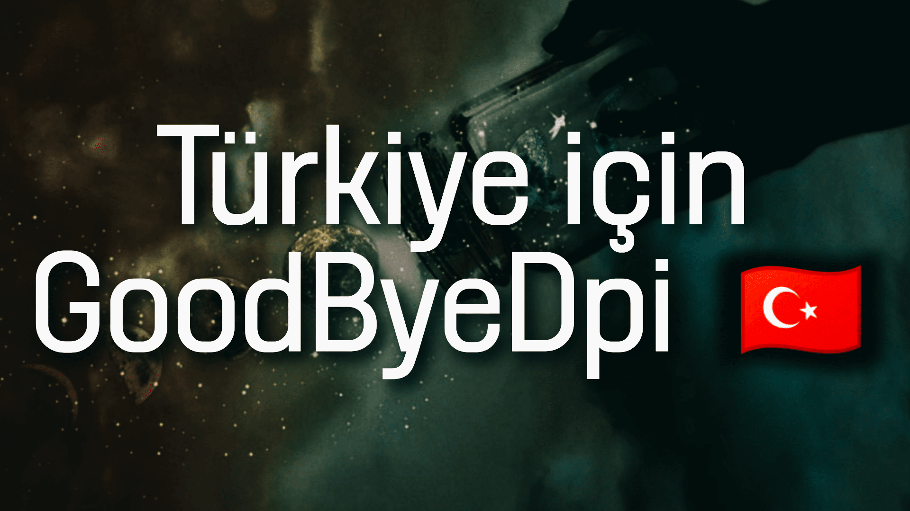

<h2 align="center"><b>Türkiye için GoodbyeDPI (GoodByeDPITurkey)</b>
</h2>
<h4 align="center">ağının gerçek hızıyla engelli sitelere eriş</h4>

 

# Türkiye için GoodbyeDPI ayarları

Bu depo ile Türkiye için GoodByeDPITurkey ayarlarını çekebilirsiniz.

Ayrıntılı bilgi için orijinal depo: https://github.com/ValdikSS/GoodbyeDPI

# Kullanım

[Buradan](https://github.com/HuzunluArtemis/GoodByeDPITurkey/archive/main.zip) indirin ve kullanmaya başlayın.

# Benzer projeler

- **[zapret](https://github.com/bol-van/zapret)** by @bol-van (for Linux).
- **[Green Tunnel](https://github.com/SadeghHayeri/GreenTunnel)** by @SadeghHayeri (for MacOS, Linux and Windows).
- **[DPITunnel](https://github.com/zhenyolka/DPITunnel)** by @zhenyolka (for Android).
- **[PowerTunnel](https://github.com/krlvm/PowerTunnel)** by @krlvm (for Windows, MacOS and Linux).
- **[PowerTunnel for Android](https://github.com/krlvm/PowerTunnel-Android)** by @krlvm (for Android).

### Bildir

eğer çalışan bir ayar (config) yaptıysan [hatalar](https://github.com/HuzunluArtemis/GoodByeDPITurkey/issues) kısmından bildir ekleyelim.

### Uyarı

bu makaledeki uygulamaların gizlilik sözleşmelerini okuyunuz. eğer ne yaptığınızı bilmiyorsanız bu işlemlerden uzak durun. programlar bana ait olmadığı için hiçbir sorumluluk kabul etmiyorum.

### Lisans

  

tüm sorumluluk kullanıcıya aittir. kullanabilir, çalışabilir ve paylaşmayı istediğiniz gibi geliştirebilirsiniz. özellikle, özgür yazılım vakfı tarafından yayımlanan [GNU Genel Kamu Lisansı](https://www.gnu.org/licenses/gpl.html) koşulları altında, lisansın 3. sürümü veya daha sonraki sürümlerinde yeniden dağıtabilir ve/veya değiştirebilirsiniz.
